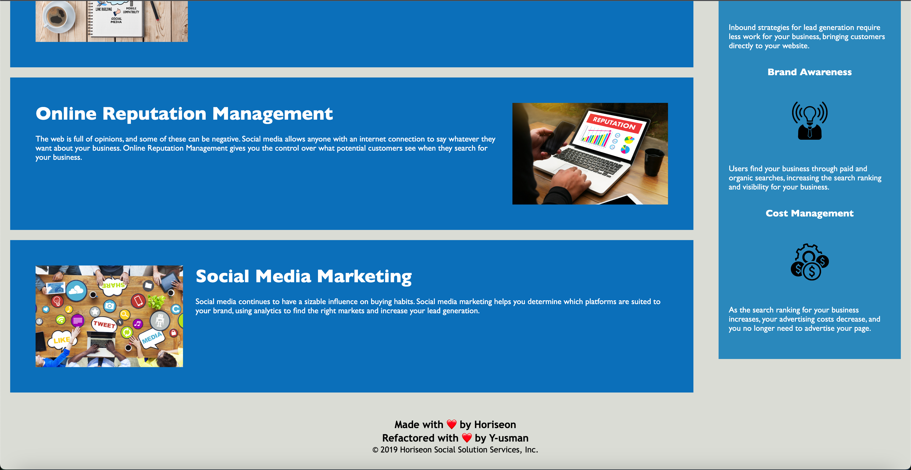
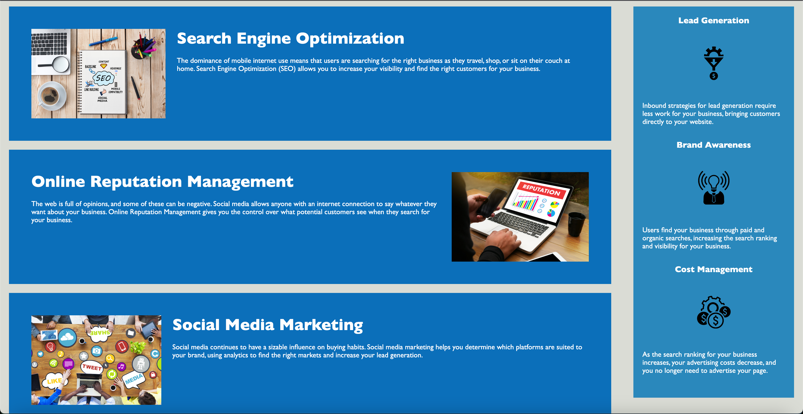

# 01 HTML CSS Git: Code Refactor - Horiseon Marketing Agency

## Description

- What was your motivation?
I was motivated by my deep interest and passion for technology. I enjoy working with cutting-edge tools and solutions, and working on this project which helps provide better web accessiblity to users who might have certain disabilities which prevent them from using the old site.

- Why did you build this project? (Note: the answer is not "Because it was a homework assignment.")
I built this project by refactoring existing code to provide better functionality and accessibility which make it a more inclusive project.

- What problem does it solve?
It makes use of assistive technologies with put into consideration video captions, screen readers, and braille keyboards which users with disabilities might find helpful. It also positions the site better on search engines by using cutting edge SEO techniques.

- What did you learn?
I have learnt about the importance of web accessibility, proper documenting and clean code. I have also learnt about agile design and development & the "scout rule". I have learned about the importance of licenses and referencing any code/material used that is not originally authored by me.

## Installation

## Usage

  

  

  

  **Note**: This layout is designed for desktop viewing, so you may notice that some of the elements don't look like the mock-up at a resolution smaller than 768px. Eventually you'll learn how to make elements responsive so that your web application is optimized for any screen size.

## Credits

## License

MIT License

Copyright (c) [2023] [Yusuf A Usman](https://github.com/Y-usman/edxbootcamp/starter)

## Features

## How to Contribute

## Tests